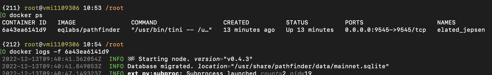

<h1 align="center">Arbitrum Full Node Installation Guide

## If you don't want to having problems with claim for a possible Arbitrum airdrop, this guide is for you. Do not forget to star and fork from the top right. If you have questions: [Chat](https://t.me/bxdoan)


## System Requirements:
NODE TYPE | CPU     | RAM      | SSD     |
| ------------- | ------------- | ------------- | -------- |
| Mainnet | 6          | 8         | 400-500  |

## Important links for Arbitrum:
- [Website](https://arbitrum.io/)
- [Explorer](https://arbiscan.io)
- [Twitter](https://twitter.com/arbitrum)
- [Discord](https://discord.gg/arbitrum)
- [Github](https://github.com/OffchainLabs)

# 1) Before installing node, get your endpoint from Alchemy.

read [alchemy](./alchemy.md)

# 2) Install the Arbitrum node.

## 2a) Scripted installation.

``` 
wget -O arbitrum.sh https://raw.githubusercontent.com/bxdoan/Arbitrum-Node/main/arbitrum.sh && chmod +x arbitrum.sh && ./arbitrum.sh
```


## Enter the `https` part you copied from Alchemy when it asks for `L1URL`

## 2b) Manual installation.

You can also install the node [manually](https://github.com/bxdoan/Arbitrum-Full-Node/blob/main/arbitrum_manual.md) to improve your Node knowledge.

## 3) Check your logs.

Learn Docker Container ID with following command.

``` 
docker ps
```


After that, check your node logs. Change `<ID>` part with the Container ID that you obtained from the command above.

``` 
docker logs -f <ID>
```



## 4) Adding your node rpc url to metamask after node installation.


## Click `add network manually`.


- `Network Name`: Does not matter


- `RPC URL`: "http://" + your server IP + ":8547" (As seen from the above picture)


- `Chain ID`: 42161


- `Currency`: Say ETH


- `Explorer`: https://arbiscan.io
